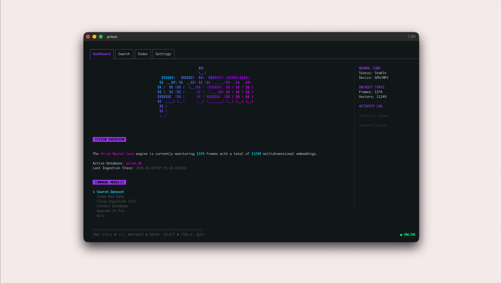

<p align="center">
  
</p>

<h1 align="center">Prism</h1>

<p align="center">
  <strong>Semantic Search for Autonomous Vehicle & Robotics Datasets</strong>
</p>

<p align="center">
  <em>Find any frame in terabytes of sensor data using natural language. 100% local. Zero cloud dependencies.</em>
</p>

<p align="center">
  <a href="https://github.com/sjanney/prism/actions"></a>
  <a href="https://github.com/sjanney/prism/blob/main/LICENSE"></a>
  <a href="https://github.com/sjanney/prism/releases"></a>
</p>

<p align="center">
  <a href="#quick-start">Quick Start</a> •
  <a href="#how-it-works">How It Works</a> •
  <a href="#features">Features</a> •
  <a href="#documentation">Docs</a> •
  <a href="#contributing">Contributing</a>
</p>

---

## The Problem

Engineers working with autonomous vehicles and robotics generate **terabytes of sensor data**. Finding specific scenarios—a pedestrian jaywalking, a cyclist at dusk, a truck blocking an intersection—means hours of manual review or brittle keyword searches through metadata.

## The Solution

**Prism** lets you search your image and video datasets with natural language:

> *"red car turning left at intersection"*
> 
> *"pedestrian with umbrella crossing street"*
> 
> *"construction zone with orange cones"*

Prism uses state-of-the-art vision AI (YOLOv8 for detection, Google SigLIP for semantic understanding) running **entirely on your local machine**. Your data never leaves your network.

---

## Quick Start

### Requirements

- Python 3.9+ (GPU recommended: CUDA or Apple MPS)
- Go 1.21+

### Installation

```bash
# Clone the repository
git clone https://github.com/sjanney/prism.git
cd prism

# Install dependencies and build
make install
make build

# Launch Prism
./run_prism.sh
```

### Your First Search

1. Select **Index New Data** → enter `data/sample` → press Enter
2. Wait for indexing to complete (~10 seconds)
3. Select **Search Dataset** → type `car` → press Enter

**You're now searching images with natural language.**

> 💡 First run downloads AI models (~2GB). Subsequent launches are instant.

---

## How It Works

```
┌─────────────┐     ┌─────────────┐     ┌─────────────┐
│   Images/   │────▶│   YOLOv8    │────▶│   SigLIP    │
│   Videos    │     │  Detection  │     │  Embedding  │
└─────────────┘     └─────────────┘     └─────────────┘
                                              │
                                              ▼
┌─────────────┐     ┌─────────────┐     ┌─────────────┐
│   Search    │◀────│   Vector    │◀────│   SQLite    │
│   Results   │     │  Similarity │     │   + NumPy   │
└─────────────┘     └─────────────┘     └─────────────┘
```

1. **Indexing**: For each image/video frame, Prism detects objects (cars, pedestrians, signs) and generates semantic embeddings
2. **Storage**: Embeddings are stored locally in SQLite with NumPy vector blobs
3. **Search**: Your query is embedded and compared against all indexed frames using cosine similarity
4. **Results**: Matching frames are ranked and displayed in the TUI

---

## Why Local-First?

| Challenge | Prism's Approach |
|-----------|------------------|
| **Data Sensitivity** | Proprietary AV data stays on your machine—no cloud uploads |
| **Cost** | No egress fees, no API costs, no subscription |
| **Speed** | Sub-second queries on local hardware |
| **Compliance** | Full control for GDPR, SOC2, and enterprise security requirements |
| **Offline** | Works without internet after initial model download |

---

## Features

### Core Capabilities

| Feature | Description |
|---------|-------------|
| **Natural Language Search** | Query with plain English: "truck at loading dock" |
| **Video Indexing** | Automatically extract and index frames from MP4, AVI, MOV, MKV |
| **Object-Aware** | YOLOv8 detects 80+ object classes for context-rich indexing |
| **Cross-Platform** | Runs on macOS (MPS), Linux (CUDA), and Windows (CPU/CUDA) |
| **Terminal UI** | Beautiful, keyboard-driven interface with real-time progress |
| **gRPC API** | Integrate Prism into your existing pipelines |

### Video Support

Prism extracts frames intelligently:
- **1 frame per second** by default (configurable)
- **Max 300 frames per video** to prevent index bloat
- Frames reference source video with timestamps

### Configuration

```yaml
# ~/.prism/config.yaml
video:
  enabled: true
  frames_per_second: 1.0
  max_frames_per_video: 300

device: auto  # auto, cuda, mps, cpu
```

---

## Documentation

| Guide | Description |
|-------|-------------|
| [Getting Started](docs/getting-started.md) | Detailed installation and first run |
| [Architecture](docs/architecture.md) | System design and data flow |
| [Configuration](docs/configuration.md) | All configuration options |
| [Benchmarks](docs/benchmarks.md) | Performance testing and diagnostics |
| [API Reference](docs/api-reference.md) | gRPC service documentation |
| [Error Codes](docs/error-codes.md) | Troubleshooting common issues |

---

## Tech Stack

| Component | Technology |
|-----------|------------|
| **Frontend** | Go, [Bubbletea](https://github.com/charmbracelet/bubbletea), [Lipgloss](https://github.com/charmbracelet/lipgloss) |
| **Backend** | Python, PyTorch, gRPC |
| **Detection** | [YOLOv8](https://github.com/ultralytics/ultralytics) (Ultralytics) |
| **Embeddings** | [SigLIP-SO400M](https://huggingface.co/google/siglip-so400m-patch14-384) (Google) |
| **Storage** | SQLite, NumPy |

---

## Roadmap

- [ ] **Prism Pro**: Unlimited indexing, S3/GCP ingestion, remote GPU mode
- [ ] **Export**: YOLO/COCO format output for training pipelines
- [ ] **Clustering**: Automatic scene grouping and anomaly detection
- [ ] **Web UI**: Browser-based interface option

---

## Contributing

We welcome contributions! Please see [CONTRIBUTING.md](CONTRIBUTING.md) for guidelines.

```bash
# Run the test suite
make test

# Check formatting
make fmt
```

---

## License

Apache 2.0 — see [LICENSE](LICENSE) for details.

---

<p align="center">
  <sub>Built with ❤️ for the AV & robotics community by <a href="https://github.com/sjanney">Shane Janney</a></sub>
</p>
