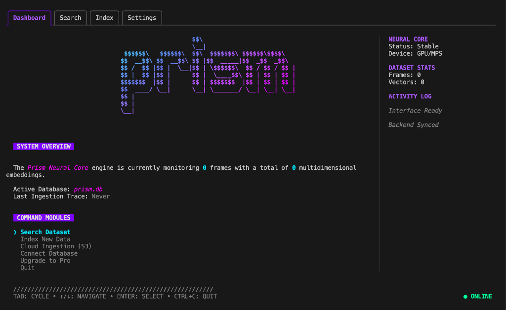

<p align="center">
  
</p>

<h1 align="center">🌈 Prism</h1>
<p align="center">
  <strong>Semantic Search for Local Image Datasets</strong><br>
  <em>Find anything in your data with natural language. No cloud. No limits.</em>
</p>

<p align="center">
  <a href="#-quick-start">Quick Start</a> •
  <a href="#-features">Features</a> •
  <a href="#-documentation">Docs</a> •
  <a href="#-prism-pro">Pro</a> •
  <a href="#-contributing">Contributing</a>
</p>

---

## 🎯 What is Prism?

Prism is a **local-first, privacy-preserving** semantic search engine for image datasets. It's designed for engineers working with autonomous vehicles, robotics, and computer vision who need to find specific frames in terabytes of data—without uploading anything to the cloud.

**Think "Google Photos search" for your raw sensor data.**

Instead of manually tagging or grepping through logs, just type:
> *"red car turning left at intersection"*

Prism uses state-of-the-art vision models (YOLOv8 + Google SigLIP) running **entirely on your machine** to understand and search your images.

---

## ✨ Features

| Feature | Description |
|---------|-------------|
| 🔍 **Semantic Search** | Query with natural language like "pedestrian with umbrella" |
| 🏠 **Local-First** | All processing on your machine. Your data never leaves. |
| 🎯 **Object Detection** | YOLOv8-powered detection for context-aware indexing |
| ⚡ **GPU Accelerated** | Supports CUDA, Apple MPS, and CPU fallback |
| 🖥️ **Beautiful TUI** | A stunning terminal interface built with [Bubbletea](https://github.com/charmbracelet/bubbletea) |
| 📂 **Native File Picker** | Open a real folder dialog from the terminal (macOS/Windows) |
| 🔌 **gRPC API** | Integrate Prism into your own tools and pipelines |

### 💎 Prism Pro

Unlock advanced features for teams and power users:

| Pro Feature | Description |
|-------------|-------------|
| ♾️ **Unlimited Indexing** | Bypass the 5,000 image free limit |
| ☁️ **Cloud Ingestion** | Index directly from S3/GCP/Azure buckets |
| 🖧 **Remote Core** | Connect the TUI to a remote GPU server |
| 📤 **Advanced Export** | Export search results to YOLO/COCO format |

---

## 🚀 Quick Start

### Prerequisites

*   **Python 3.9+** (GPU recommended)
*   **Go 1.21+**
*   **Protoc** (Protocol Buffer Compiler)

### Installation

```bash
# 1. Clone the repository
git clone https://github.com/sjanney/prism.git
cd prism

# 2. Install dependencies
make install

# 3. Build & Run
make build
./run_prism.sh
```

### First Steps

1.  Navigate to **Index New Data** using arrow keys.
2.  Press **`o`** to open the native folder picker, or type a path.
3.  Press **Enter** to start indexing.
4.  Once complete, go to **Search** and type your query!

---

## 📚 Documentation

Full documentation is available in the [`docs/`](docs/) folder:

| Document | Description |
|----------|-------------|
| [Getting Started](docs/getting-started.md) | Installation and first run |
| [Architecture](docs/architecture.md) | How Prism works under the hood |
| [Configuration](docs/configuration.md) | Customizing Prism's behavior |
| [Error Codes](docs/error-codes.md) | Troubleshooting common issues |
| [API Reference](docs/api-reference.md) | gRPC API for integrations |

---

## 🛠️ Tech Stack

*   **TUI Frontend**: [Go](https://go.dev/) + [Bubbletea](https://github.com/charmbracelet/bubbletea) + [Lipgloss](https://github.com/charmbracelet/lipgloss)
*   **AI Backend**: [Python](https://www.python.org/) + [PyTorch](https://pytorch.org/)
*   **Communication**: [gRPC](https://grpc.io/) + Protocol Buffers
*   **Models**:
    *   [YOLOv8](https://github.com/ultralytics/ultralytics) (Object Detection)
    *   [Google SigLIP](https://huggingface.co/google/siglip-so400m-patch14-384) (Semantic Embeddings)
*   **Storage**: SQLite + NumPy Vector Blobs

---

## 🤝 Contributing

We welcome contributions! See [CONTRIBUTING.md](CONTRIBUTING.md) for guidelines.

```bash
# Run tests
make test

# Format code
make fmt
```

---

## 📄 License

Apache 2.0 License. See [LICENSE](LICENSE) for details.

---

<p align="center">
  <sub>Built with ❤️ by <a href="https://github.com/sjanney">Shane Janney</a></sub>
</p>
